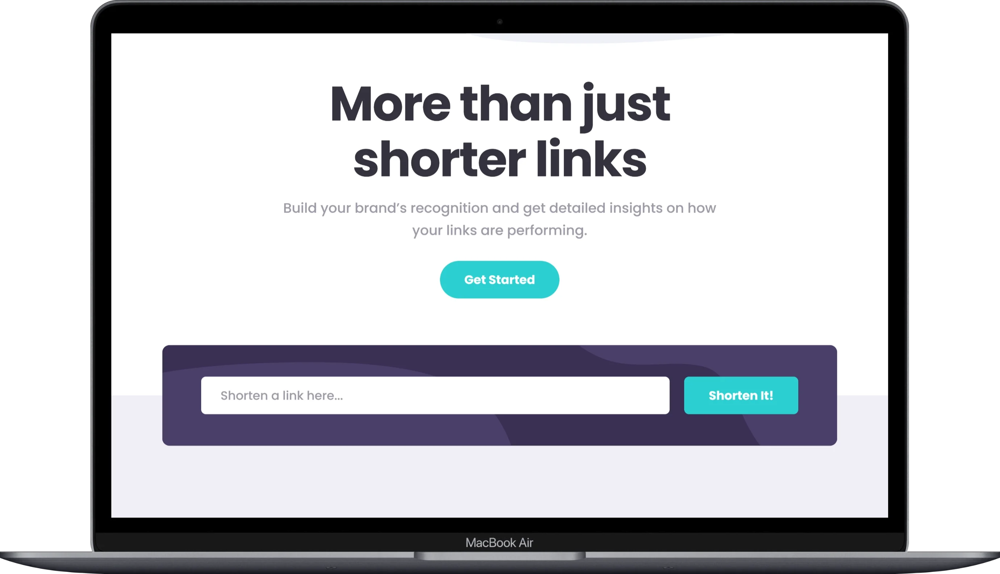
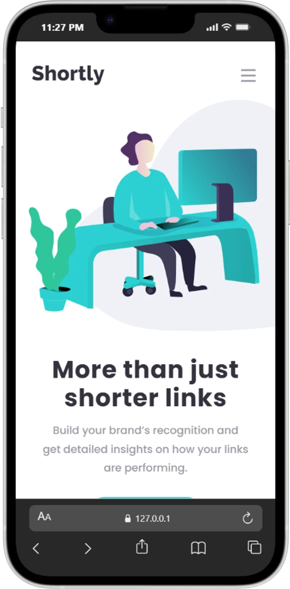

# Shortly – URL Shortening API Landing Page

A modern URL shortener that uses the **[is.gd API](https://is.gd/apishorteningreference.php)** to generate shortened links. It features real-time validation, clipboard copy functionality, and fully responsive design optimized for all screen sizes.

| MacBook Air Preview                               | iPad Pro 11 Preview                              | iPhone 14 Plus Preview                              |
| ------------------------------------------------- | ------------------------------------------------ | --------------------------------------------------- |
|  |  |  |

---

## Links

- Solution URL: [GitHub](https://github.com/JuliAlchemDev/FM-url-shortening-api)
- Live Site URL: [GitHub Pages](https://julialchemdev.github.io/FM-url-shortening-api/)

---

## Features

- Shortens valid URLs using the **[is.gd API](https://is.gd/apishorteningreference.php)**
- Real-time form validation with custom error messaging
- Dynamic rendering of shortened link cards
- One-click copy to clipboard with visual feedback
- Mobile-first responsive layout (mobile, tablet, desktop)
- Toggleable navigation menu for smaller screens
- Custom CSS design system using variables
- Accessible markup with screen-reader labels and `aria-live` updates
- Hover and focus-visible states for interactive elements
- Performance Optimization through strategic font preloading
- Lean HTML structure using CSS pseudo-elements for decorative assets and icons
- Modular JavaScript (ESM) architecture for improved project scalability
- Unit Testing Suite implemented with **Jest** to ensure core logic reliability

---

## Built With

---

## Our Process

### Julia's Contribution

- Established the project's **Architecture and Design System**, including a modular folder structure, `reset.css` implementation, and a scalable design system using **design tokens** (CSS variables) for consistent typography and spacing.
- Developed the fully responsive **Header and Hero sections**, ensuring a mobile-first approach and resolving complex layout issues, such as the desktop horizontal overflow bug.
- Engineered the **Statistics section's UI**, utilizing **CSS pseudo-elements** (`::before` and `::after`) for icon rendering and decorative connecting lines to maintain a clean and semantic HTML structure.
- Built the structural foundation for the **URL shortener**, creating the input form and result card templates using **BEM methodology** and semantic HTML5 elements.
- Led the **Modular JavaScript Refactoring (ESM)**, transitioning the codebase from a monolithic file into a clean, multi-module architecture (`api.js`, `ui.js`, `handlers.js`) to improve maintainability and testability.
- Implemented a comprehensive **Unit Testing** suite, configuring the **Jest environment** and developing tests to verify API integration, DOM manipulation, and core business logic.
- Improved project-wide **accessibility** by integrating ARIA attributes, ensuring proper button types, and implementing `:focus-visible` states for keyboard users.
- Optimized **performance** and **service quality** with font preloading and detected issues in the initial shortening service via manual testing; migration to the **is.gd API** was carried out by a teammate.
- Maintained **repository health and professional standards**, performing cleanup of obsolete assets, organizing file directories, and updating `package.json` with appropriate metadata and licenses.

### Elmar's Contribution

- Enhanced the `<head>` section with proper SEO metadata, Open Graph tags, Twitter cards, canonical links, and favicon setup to improve discoverability and sharing previews.
- Built the **Statistics section** using semantic HTML and BEM methodology, ensuring clean structure and scalable styling.
- Implemented the **URL shortener logic** using JavaScript:
  - Integrated the **[is.gd API](https://is.gd/apishorteningreference.php)** using `fetch` and `async/await`.
  - Added client-side validation using HTML5 form validation APIs.
  - Provided real-time UI feedback for invalid input.
  - Dynamically rendered shortened link cards in the DOM.
- Developed **copy-to-clipboard functionality** using the Clipboard API with visual state updates ("Copied!" button state).
- Styled and enhanced the **Shortener section UI**, including validation states, focus styles, and responsive behavior.
- Fully structured and styled the **Footer section**, applying accessibility considerations and responsive layout techniques.
- Ensured accessibility improvements across sections:
  - Used semantic elements and proper heading hierarchy.
  - Applied `aria-live="polite"` for dynamically added shortened links.
  - Implemented `:focus-visible` states for keyboard users.
- Applied a scalable CSS architecture using custom properties (design tokens), consistent spacing scale, and responsive breakpoints.
- Resolved merge conflicts and removed duplicated HTML introduced during collaboration.
- Organized repository workflow by setting up a `.github` directory and maintaining structured pull request practices.

---

## What We Learned

- Strengthened our understanding of integrating external APIs using `fetch`, `async/await`, and handling asynchronous data flows.
- Practiced implementing form validation using both native browser validation and custom UI feedback.
- Improved our skills in dynamic DOM manipulation, including generating components and handling event delegation.
- Gained experience working with the Clipboard API and managing UI state transitions.
- Deepened our understanding of accessibility patterns such as `aria-live`, semantic structure, and focus management.
- Reinforced scalable CSS architecture principles using design tokens, responsive breakpoints, and consistent spacing systems.
- Learned how to collaborate effectively through pull requests, merge conflict resolution, and maintaining clean commit history.
- Improved attention to detail when implementing SEO metadata and structured head elements for production readiness.
-  Learned to refactor monolithic code into an ESM modular system (api.js, ui.js, handlers.js) to improve maintainability and testability.
- Mastered the use of pseudo-elements `::before` / `::after` to render decorative assets and icons, significantly reducing HTML bloat.
- Understood the impact of font preloading techniques on initial load times and overall web performance.
- Experienced the process of migrating between external API providers (CleanURI to is.gd) and refactoring logic to ensure service continuity.
- Actively engaged in peer code reviews, implementing complex refactors and BEM naming improvements based on collaborator feedback to ensure project consistency and high code quality.
- Conducted thorough manual testing and visual verification across multiple breakpoints to identify and resolve layout regressions, such as the hero image overflow on desktop.
- Demonstrated project ownership and professional care by maintaining high standards in PR documentation, meticulously tracking changes, and providing detailed technical notes for peer reviewers.
---

## Acknowledgements

- Design challenge by [Frontend Mentor](https://www.frontendmentor.io/challenges/url-shortening-api-landing-page-2ce3ob-G)
- URL shortening powered by the [is.gd API](https://is.gd/apishorteningreference.php)

---

## Collaborators

**Julia Alkhimova**

- LinkedIn - [Julia Alkhimova](https://www.linkedin.com/in/julialkhimova/)
- Frontend Mentor - [@JuliAlchemDev](https://www.frontendmentor.io/profile/JuliAlchemDev)

**Elmar Chavez**

- LinkedIn - [Elmar Chavez](https://www.linkedin.com/in/elmar-chavez/)
- Frontend Mentor - [@CodingWithJiro](https://www.frontendmentor.io/profile/CodingWithJiro)
